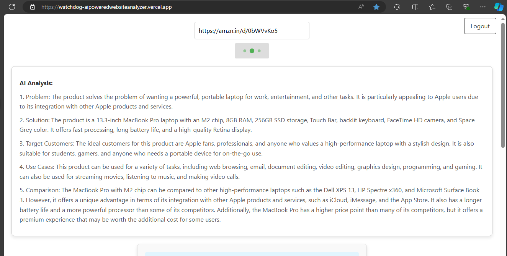
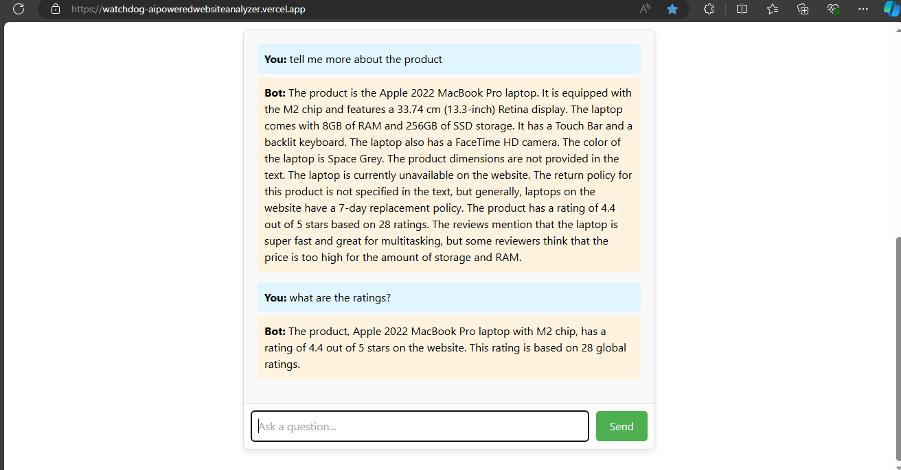

# AspireNex Tasks

Welcome to the AspireNex Tasks repository! This repository contains tasks I've created, Ecommerce Scrap Website for AspireNex. These projects showcase my skills in web development and data scraping, leveraging modern technologies to build functional and engaging web applications.

## Task 4: Watchdog - AI Powered Ecommerce Scrape Website

- **Description:** 
  This application empowers users to gain insightful analysis of any website Product/Ecommerce using an AI model (Mistral). It extracts key information about the product or service offered, including the problem it solves, the solution provided, target audience, and potential use cases and comparison. Users can then interact with an AI chatbot to delve deeper into the analysis or ask further questions about the website's content.

- **Features:**
  - **Website Analysis:** Extracts relevant text from a specified website URL.
  - **AI-Powered Insights:** Leverages the Mistral AI model to analyze the website text and generate a comprehensive summary focusing on key product/service aspects.
  - **Interactive Chatbot:** Enables users to engage in a conversation with an AI chatbot to explore the analysis results in more detail or ask questions.
  - **User Authentication (Firebase):** Ensures secure access and user management through Firebase authentication, supporting both email/password and Google sign-in.

- **Technologies Used:**
  - **Frontend:** React
  - **Backend:** Node.js, Express.js, Cheerio, Axios
  - **AI Model:** Mistral
  - **Authentication:** Firebase

- **Deployment Link: [Live](https://watchdog-aipoweredwebsiteanalyzer.vercel.app/)**
- **Demo Screen Recording:** [**Watchdog-AI Powered Ecommerce Scrape Website**](https://drive.google.com/file/d/1fWw4zLlm0Ot6fszDtHqv7E_uJ_ZrZxeO/view?usp=drive_link)
### Analysis of the Product:

### Chatbot to ask anything related to product:


## Installation and Setup

**Prerequisites:**

* Node.js and npm (or yarn)
* Firebase project with authentication enabled
* Mistral API key

**Backend Setup:**

1. Clone this repository.
2. Navigate to the `backend` directory: `cd backend`
3. Install dependencies: `npm install`
4. Create a `.env` file in the `backend` directory and add your Mistral API key:
```plaintext
 MISTRAL_API_KEY=your_mistral_api_key
```
5. Run the server: `npm start`

**Frontend Setup:**

1. Navigate to the `frontend` directory: `cd frontend`
2. Install dependencies: `npm install`
3. Update `firebase.js` with your Firebase configuration details:
```plaintext
REACT_APP_FIREBASE_API_KEY=
REACT_APP_FIREBASE_AUTH_DOMAIN=
REACT_APP_FIREBASE_PROJECT_ID=
REACT_APP_FIREBASE_STORAGE_BUCKET=
REACT_APP_FIREBASE_MESSAGING_SENDER_ID=
REACT_APP_FIREBASE_APP_ID=
```
4. Start the development server: `npm start`

## Usage

1. Open the application in your browser.
2. If required, log in or sign up using your email/password or Google account.
3. Enter the website URL you want to analyze.
4. Click "Analyze."
5. Once the website text is fetched, a chatbot window will appear.
6. Interact with the chatbot to ask questions about the website or the analysis results.

## Support
If you encounter any issues or have questions about these projects, please feel free to reach out:

**Email:** deeprahangdale2003@gmail.com
**LinkedIn:** https://www.linkedin.com/in/deeprahangdale

## License
This project is licensed under the MIT License. See the LICENSE file for details.

By following these steps, you can run each project locally on your machine. Ensure you navigate to the correct project directory before installing dependencies and starting the development servers. Thank you for exploring the AspireNex Tasks repository!

